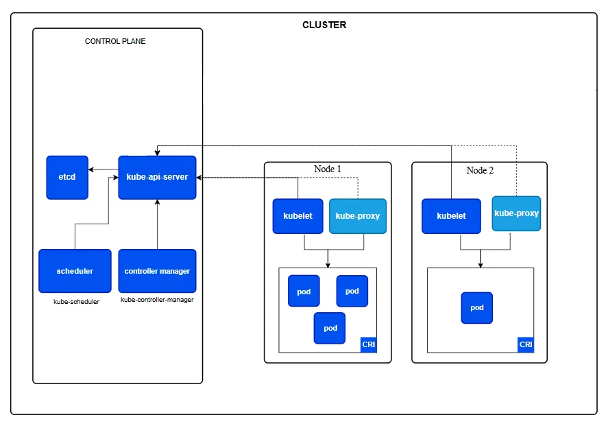

# K8S

**Kubernetes** is an **open-source platform** for **automating deployment**, **scaling** & **management of containerized applications**.

**Why it is needed**

1. **Manual Management** is **hard running containers manually** on **many servers** is error-prone.
2. **Scaling**: **Automatically add** or **remove containers** based on demands.
3. **Load Balancing**: Distributes traffic evenly across containers.
4. **Self-Healing**: Restarts fail containers, replace them or kill unresponsive ones. 
5. **Deployment Automation**: Helps to **roll-out** and **roll-back app version** easily.
6. **Networking** **among** container on **different host**.
7. **To update new version of image**.

---

# Kubernetes Architecture (kubeadm)



## Components of Master-Node

- **kube-api-server**
    - The "**brain**" of **Kubernetes**.
    - **Takes commands** from **users** (**`kubectl`**).
    - Checks if the **requests are valid**.
    - **Talks** to all **other components**.
    - Acts as the **gatekeeper**: all traffic to the cluster’s control plane **must pass through it.**
        - Everyone (users, controllers, scheduler) **must pass through it**.
    
    In Short, “**API server is the entry gate + rule checker**”.
    
- **kube-scheduler**
    - Decides which **host/node** should **run** a new **Pod**.
    - **Chooses** based on **available resources** (**CPU, memory, etc**.).
        - Runs **scheduling algorithms** to choose the “best” node:
            - Resource fit (CPU, RAM, GPU, etc.)
            - Affinity/anti-affinity rules
            - Taints and tolerations
            - Topology spread (across AZs/nodes)
    - **Pluggable**: You can write custom schedulers or scheduling plugins.
    
    In Short, “**The scheduler is the smart matchmaker for pods → nodes***.*”.
    
- **kube-controller**
    - Creation & deletion of
    - Runs background tasks to keep things working as expected.
    - Includes:
        - Node Controller: Watches nodes (are they healthy?).
        - Replication Controller: Makes sure the right number of Pods are running. (and more).
- **etcd**
    - A **database** that stores everything about the **cluster**.
    - **Keeps track** of the **current state** and **configuration**.
    - **Role:** The **source of truth** for the cluster.
    - Stores:
        - Configurations
        - Secrets
        - Pod states, node info
        - Service discovery info (endpoints, networking)

## Components of Worker-Node

- **kubelet**
    - **Agent** on **each** **worker node**.
    - **Talks** to the **API server**.
    - Makes sure the **containers** (**Pods**) are **running properly**.
- **kube-proxy**
    - **Handles networking**.
    - **Makes sure traffic goes to the right Pod**.
- **container runtime interface**(`containerd`)
    - **Starts** and **runs containers**.
    - **Kubernetes** talks to it **using CRI** (Container Runtime Interface).

## Workflow

- **Step 1** - **Manifest File**
- **Step 2** - **Apply** the manifest file. **`kubectl apply -f pod.yaml`**
- **Step 3** - **`kubectl`** **Talks** to the **`kube-apiserver`**
    - **`kubectl`** **sends** a **REST API request** to the **API Server**
    - The **API Server**:
        - **Validates** the **YAML** (**syntax, schema**).
        - **Stores** the **pod definition** in **`etcd`** (the **cluster's database**).
        - **Confirms**: “**Pod has been created**.”
- **Step 4** - **`kube-scheduler`**
    - The **Scheduler constantly watches** for **Pods** that **don’t have a Node assigned**.
    - It sees our new pod (`mypod`) and **decides** which **node is best** (based on CPU, & memory).
    - It **assigns** the **pod** to a **specific Worker Node.**
- **Step 5** - **Back to** **`kube-apiserver`**
    - The **scheduler** **updates** the **API server with the chosen node info**.
    - Now the Pod object is **updated** and **saved** in **`etcd`** with `nodeName: worker-node-1`
- **Step 6** - `kubelet` on the Worker Node Takes Over
    - The kubelet on the selected node (e.g., `worker-node-1`) watches the API server for any pods assigned to it.
    - It sees our pod and says: “Okay, I need to run this container.”
- **Step 7** - **`kubelet`** **Talks to the Container Runtime**
    - **Kubelet** uses the **Container Runtime Interface** (CRI) to talk to the **runtime** (`containerd`)
    - The **container runtime pulls the image** and **starts the container**.
- **Step 8** - **`kube-proxy` Handles Networking**
    - Once the pod is running, **`kube-proxy`** **sets up networking rules**.
    - It **allows communication** between this **pod** and **other pods/services**.
- **Step 9** - Verify Running Pod
    - `kubectl get pods`

### Simple Work-Flow Overview | Work-Flow Summary

```
kubectl apply
   ↓
kube-apiserver (validates + stores in etcd)
   ↓
kube-scheduler (chooses node)
   ↓
kube-apiserver (updates Pod with node info)
   ↓
kubelet (on selected node sees the pod)
   ↓
Container Runtime (runs the container)
   ↓
kube-proxy (sets up networking)
   ↓
Pod is Running
```

---

# Basic Commands

```bash
# Basic K8S Commands

# to view nodes in cluster
kubectl get nodes

# to view pods
kubectl get pods             # pods / pod / po, all works the same
kubectl get pod
kubectl get po
# attribute 
kubectl get pods -A          # to view pods from all namespace.
kubectl get pods -n default  # to view pods from specific namespace
kubectl get pods -o wide     # more detail info about nodes in current namespace
kubectl get pods -n <namespace> -o wide # detail info about nodes in following namespace
kubectl get pods --show-labels

# to run a simple pod
kubectl run <name-the-pod> --image=<image-name>
kubectl run web --image=nginx
# opens a shell inside a running pod
kubectl exec -it <pod-name> /bin/bash
kubectl exec -it web bash

kubectl logs <pod-name>

kubectl delete pod <pod-name>  # delete pod by name
kubectl delete pod <pod-name> --force
kubectl delete pod <pod-name> --grace-period=0 --force
kubectl delete -f <manifestfile.yaml> # delete pod via YAML file

kubectl expose pod <pod-name> --type=NodePort --port=<containers-port>
kubectl port-forward <pod-name> <local-port>:<containers-port>

kubectl get ns
kubectl create ns <name-space-name>

kubectl apply -f file.yml
kubectl apply -f file.yml -n <define-wich-namespace>
```

# Manifest Files

## kind - Pod

### Nginx

- Simple, nginx manifest file.
    
    ```yaml
    # nginx-pod.yml
    **apiVersion: v1
    kind: Pod
    metadata:
      name: nginx-pod
    spec:
      containers:
        - name: nginx-container
          image: nginx
          ports:
            - containerPort: 80**
    ```
    
    - **Apply the file** - **`kubectl apply -f nginx-pod.yml`**
    - **To delete** - **`kubectl delete pod nginx-pod` or `kubectl delete -f nginx-pod`**
    - To **access** it **from web-browser**, we can also use **hostport** or **service**
        - **`kubectl label pod nginx-pod app=nginx`**
        - **`kubectl expose pod nginx-pod --type=NodePort --port=80`**
        - **`kubectl get svc`**
        - **http://<public-ip>:31555** (port mentioned when runned kubectl get svc)

### MySQL

- MySQL manifest file.
    
    ```yaml
    # mysql-pod.yml
    **apiVersion: v1
    kind: Pod
    metadata:
    	name: mysql-pod
    spec:
    	containers:
    		- name: mysql-container
    			image: mysql
    			ports:
    				- containerPort: 3306
    			env:
    				- name: MYSQL_ROOT_PASSWORD
    					value: "Root123"
    				- name: MYSQL_DATABASE
    					value: info
    ```
    
    - Apply File - **`kubectl apply -f mysql-pod.yml`**

### Nginx (hostPort & port-forward)

- This manifest is similar to the previous nginx example, but here we map the `hostPort` and also demonstrate `kubectl port-forward` to access the `nginx-pod` locally from the master node using `curl http://localhost:80`.
    - hostPort: Allows access from web-browser.
    
    ```yaml
    # nginx-pod.yml
    apiVersion: v1
    kind: Pod
    metadata:
      name: nginx-pod
    spec:
      containers:
        - name: nginx-container
          image: nginx
          ports:
            - containerPort: 80
    	        hostPort: 80
    ```
    
    - Apply file - `kubectl apply -f nginx-pod.yml`
    - Port Forward - `kubectl port-forward nginx-pod 80:80`
        - Syntax for above command, `kubectl port-forward <pod-name> <local-port>:<containers-port>`
        - Now, From Master-Node, `curl localhost`
